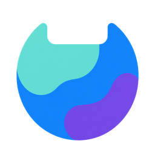
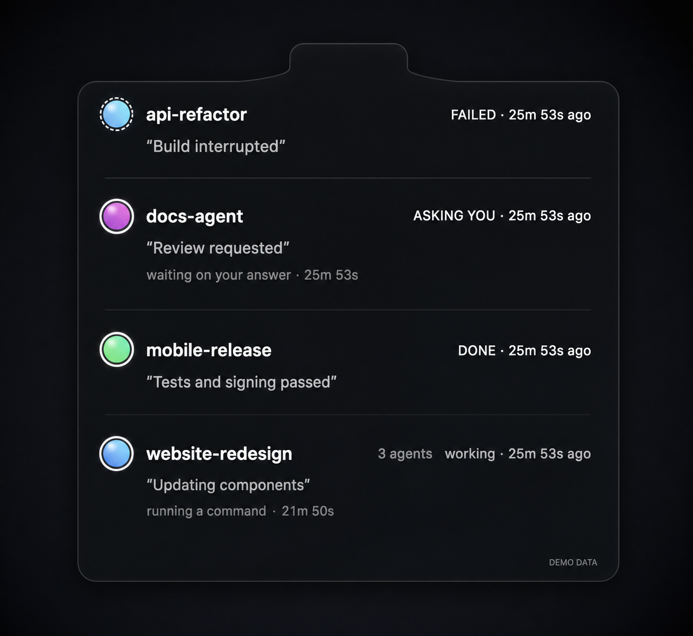
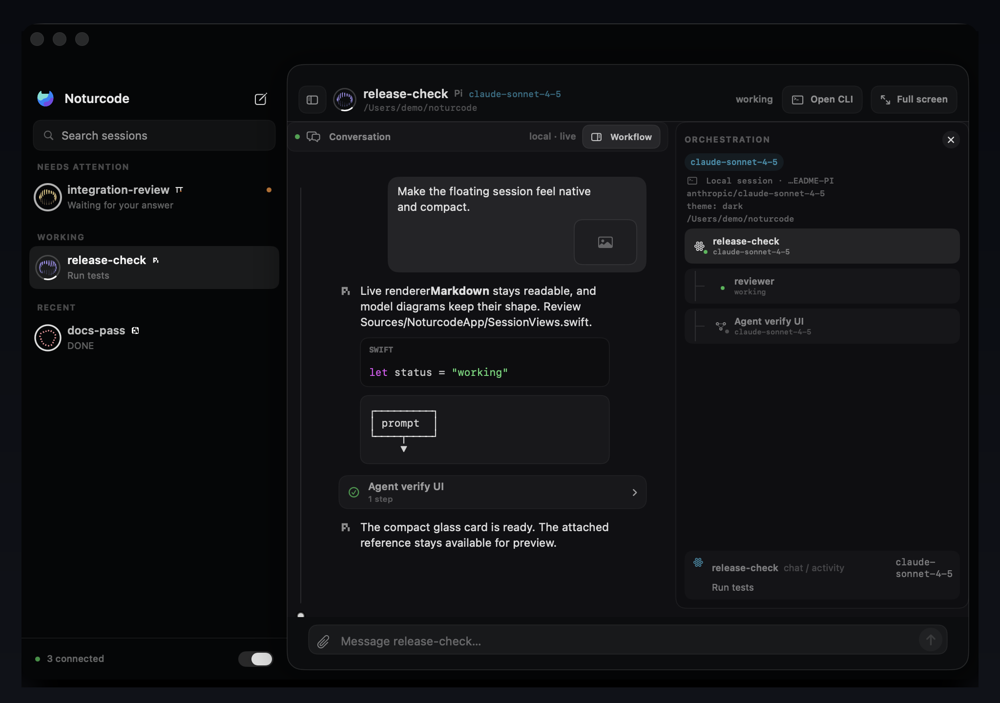

<p align="center">
  
</p>

<h1 align="center">Noturcode</h1>

<p align="center"><strong>Open-source mission control for Claude Code, Codex, and coding-agent teams on macOS.</strong></p>

<p align="center">
  See every local agent at a glance, return to the exact iTerm2 pane, and open the real conversation, tools, files, and subagents without replacing your terminal.
</p>

<p align="center">
  <a href="LICENSE"></a>
  
  
  
</p>



> The screenshots in this README are clearly labelled mockups made from sanitized demo data. No private terminal transcript or customer project is included.

## Why Noturcode

Running several coding agents creates a surprisingly physical problem: the useful work is scattered across tabs and splits. You lose the session that needs approval, notice a completed run late, or jump back to the wrong pane.

Noturcode is a small native companion for the terminal you already use:

- **Glance, then disappear.** Working, waiting, failed, and unread-completion states live in the notch or a compact external-display island.
- **Return to the actual pane.** Session identity is captured when the agent connects; a click asks iTerm2 to reveal that exact session and visibly reports stale targets.
- **Read the real conversation.** The desktop workspace reconstructs local Claude Code and Codex JSONL, including Markdown, syntax-highlighted code, tool batches, files, images, models, and token totals.
- **Inspect orchestration.** Parent sessions and Claude subagents appear as separate clickable conversations rather than a flat list of anonymous tool calls.
- **Keep control local.** No account, telemetry, cloud relay, or hosted transcript database. Hooks write to a user-owned Unix socket on the same Mac.
- **Keep your setup reversible.** Integration setup is explicit, existing hook files are backed up, and the uninstall path removes only Noturcode-owned entries.



Noturcode is an open-source Vibe Island alternative, but it is deliberately not positioned as another colored notch notifier. The project is working toward a reliable local session operating layer: status, conversation, orchestration, exact return, and control.

## Current support

The table is intentionally capability-by-capability. “Detected” does not mean every feature is implemented.

| Harness | Status | Conversation and tools | Prompt control | Main limits |
| --- | :---: | --- | --- | --- |
| Claude Code | Verified hooks | Local JSONL, tools, tokens, subagents | Exact iTerm pane | No native session creation |
| OpenAI Codex CLI | Verified hooks; native app-server is experimental | Local JSONL and native stream | Exact iTerm pane or native thread | Native tokens and full subagent threads are missing |
| Gemini CLI | Experimental hooks and ACP | Current native ACP conversation and tools | Native ACP session | Existing CLI attach, images, tokens, and subagents are missing |
| OpenCode | Experimental plugin and HTTP/SSE | Native messages/tools plus local SQLite reads | Native local server | Requires an explicit running local server; images and tokens are missing |
| Grok | Experimental ACP only | Current native ACP conversation and tools | Native ACP session | No hooks, discovery, existing-session attach, images, tokens, or subagents |

| Host | Exact pane return | Prompt delivery | Notes |
| --- | :---: | :---: | --- |
| iTerm2 | Yes | Yes | Uses iTerm2's public AppleScript session API. |
| Terminal.app | Partial, unverified | Partial, unverified | Matches a captured TTY. No live success test is published. |
| Ghostty | Partial, unverified | Partial, unverified | Matches TTY or PID. No live success test is published. |
| WezTerm / kitty | Partial, unverified | Partial, unverified | Uses native pane/window IDs and local CLIs. |
| Warp | App activation only | No | Exact pane selection is not implemented. |
| tmux / Zellij | Partial, local only | Partial, local only | Uses captured local socket/session and pane IDs. |
| SSH through `nc ssh` | Experimental; fixture-verified | Experimental; fixture-verified | One-time pairing and an SSH Unix-socket tunnel. Live host coverage is still limited. |

## Install from source

Public notarized binaries are not published yet. Until the release pipeline is signed and verified, build from source:

```sh
git clone https://github.com/TimpiaAI/noturcode.git
cd noturcode
brew install xcodegen jq
./scripts/install.sh
```

Requirements:

- macOS 15 or newer
- Xcode 16 or newer, including command-line tools
- [XcodeGen](https://github.com/yonaskolb/XcodeGen)
- `jq`
- iTerm2 for exact pane navigation and prompt delivery

The installer builds a universal app, ad-hoc signs the local build, installs it under `~/Applications`, and sets up integrations because running the installer is an explicit action. A normal app launch never edits harness configuration. It never closes iTerm2.

## Pair a VPS at no extra cost

The installer adds a safe `nc` shell function. With no arguments, `nc` opens a small interactive guide. Existing netcat commands still go to `/usr/bin/nc`.

Open a new shell after installation, or load the command now:

```sh
source ~/.config/noturcode/shell.zsh
nc
```

Choose **Pair a VPS** once. Noturcode copies a dependency-free Python helper over your existing SSH connection, shows a six-digit one-time code, backs up detected remote hook files, and configures Claude Code, Codex, and Gemini CLI when found. Then choose **Open an SSH workspace** whenever you work on that server.

```text
nc
  1. Pair a VPS
  2. Open an SSH workspace
  3. Check setup
```

The remote helper runs as your SSH user. It needs Python 3 and OpenSSH, but no root account, public port, npm package, cloud relay, or new server. The durable token is stored as mode `0600` on the VPS and only its SHA-256 hash is stored on the Mac. Agent hooks fail open if the tunnel is absent. See [the remote setup and security guide](docs/REMOTE.md).

## Connect a session

Start a new Claude Code session in iTerm2, then run:

```text
/nc website-redesign
```

Codex validates slash commands before hooks, so use the bare form:

```text
nc website-redesign
```

Disconnect only the Noturcode card—without stopping the agent—with `/nc stop` in Claude or `nc stop` in Codex. You can also disconnect from the app.

## Permissions

| Permission | Why it is requested | What Noturcode does not do |
| --- | --- | --- |
| Notifications | Completion and needs-attention banners | No marketing or remote push service |
| Automation: iTerm2 | Reveal an exact pane and send a prompt you submit | Does not close panes or type without an explicit action |
| Accessibility | Optional pane geometry spotlight | Does not read arbitrary app content or control the whole desktop |
| Login item | Optional background status companion | Disabled if you turn off “Open at Login” |

See [PRIVACY.md](PRIVACY.md) for the exact local data flow and [SECURITY.md](SECURITY.md) for reporting vulnerabilities.

## Architecture

```text
local hooks -----------> noturcode-bridge ----> user-only Unix socket
       |                                             |
       | local JSONL                                 v
       +--------------------------------------> native Swift app
                                                     |
                         notch + notifications + conversation workspace
                                                     |
                                      explicit click/send via iTerm2 API

remote hooks -> paired helper -> SSH Unix socket tunnel -> same local socket
```

The bridge is fail-open: inability to reach Noturcode must not block the coding harness. Session state is disposable local metadata, while agent transcripts remain in their original Claude/Codex locations. More detail: [docs/ARCHITECTURE.md](docs/ARCHITECTURE.md).

## Verify a checkout

```sh
xcodegen generate
xcodebuild test -project Noturcode.xcodeproj -scheme Noturcode \
  -destination 'platform=macOS,arch=arm64' \
  CODE_SIGNING_ALLOWED=YES CODE_SIGN_IDENTITY=-
```

After installation:

```sh
~/Library/Application\ Support/Noturcode/bin/noturcode-bridge doctor
```

The doctor should report a listening socket, the installed app, and `terminal: iTerm2` when invoked inside iTerm2.

## Uninstall integrations

Preview what will be removed:

```sh
./scripts/uninstall-integrations.sh --dry-run
```

Then remove Noturcode-owned hooks, skills, plugins, and the iTerm2 context-menu script:

```sh
./scripts/uninstall-integrations.sh
```

The app and local session metadata are retained unless you explicitly request data deletion. See [SUPPORT.md](SUPPORT.md) for troubleshooting and recovery.

## Project status

Noturcode is early software. Claude Code and Codex on local iTerm2 panes are the verified core. Paired SSH has fixture coverage but still needs broader live-host verification. Multi-terminal exact jump, signed updates, and broader harness transcript parity remain roadmap work. See [ROADMAP.md](ROADMAP.md).

Contributions are welcome. Start with [CONTRIBUTING.md](CONTRIBUTING.md), read the small [architecture guide](docs/ARCHITECTURE.md), and choose an issue that has a reproducible acceptance test.

## License

Noturcode is available under the [MIT License](LICENSE). Third-party harness marks remain the property of their owners; see [THIRD_PARTY_NOTICES.md](THIRD_PARTY_NOTICES.md).
